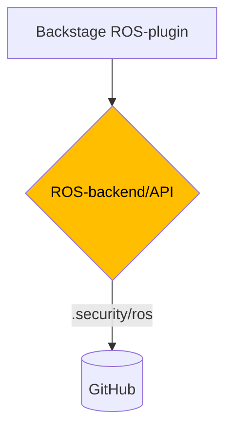
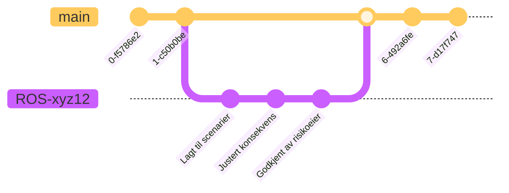

# kv-ros-backend

## High level components



## Simplified Git ROS-flow



## JSON Schema validation

The JSON schema validation is done using the [json-kotlin-schema](https://github.com/pwall567/json-kotlin-schema)
library version 0.44.  
This library has some limitations.  
It does not fully support the latest JSON Schema draft.  
It covers our need regarding the JSON Schema validation.  
If the version of the schema is updated, ensure that the library supports it.

## Docker

To build the docker image, run:

```sh
docker image build -t kv-ros-backend .
```

### Run the application using Docker

The backend application uses a gcp-secret to obtain the GithubApp-private key at the moment. In order to access this we
need a service account with permission to read them.
Configure gcloud with docker, using ```gcloud auth configure-docker```, remember to login first - either using your own
account or by impersonating a service account.

To run the docker image, run:

```sh
docker run -it -p 8080:8080 -e GCP_KMS_RESOURCE_PATH=${GCP_KMS_RESOURCE_PATH} -e SOPS_AGE_PUBLIC_KEY=${SOPS_AGE_PUBLIC_KEY} -e GITHUB_INSTALLATION_ID=${GITHUB_INSTALLATION_ID} -e GITHUB_INSTALLATION_ID=${GITHUB_INSTALLATION_ID} -e GITHUB_PRIVATE_KEY_SECRET_NAME=${GITHUB_PRIVATE_KEY_SECRET_NAME} kv-ros-backend
```

### Run the application using kubernetes

The same applies for the gcp application credentials here, so be sure to add a permissions for gcp.

````sh
# configmap 
kubectl apply -f kv-ros-backend-config.yaml

# app deployment
kubectl apply -f kv-ros-backend.yaml
````

#### Minikube lokalt for testing

````sh
gcloud auth configure-docker
# for å kunne hente gcp-secret i appen (legg til )
minikube addons enable gcp-auth
# for å kunne pulle image fra gcp
minikube addons configure registry-creds && minikube addons enable registry-creds
````

