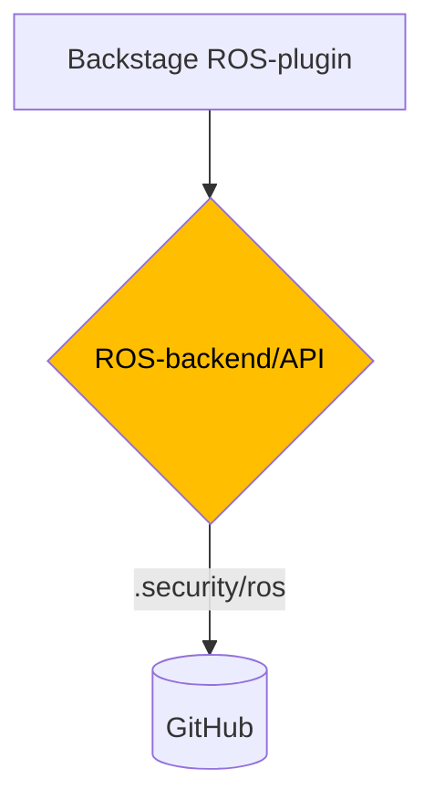

# kv-ros-backend

## High level components



## Simplified Git ROS-flow


## JSON Schema validation

The JSON schema validation is done using the [json-kotlin-schema](https://github.com/pwall567/json-kotlin-schema)
library version 0.44.  
This library has some limitations.  
It does not fully support the latest JSON Schema draft.  
It covers our need regarding the JSON Schema validation.  
If the version of the schema is updated, ensure that the library supports it.

## Docker

To build the docker image, run:

```sh
docker image build -t kv-ros-backend .
```

To run the docker image, run:

```sh
docker run -it -p 8080:8080 -e GCP_KMS_RESOURCE_PATH=${GCP_KMS_RESOURCE_PATH} -e SOPS_AGE_PUBLIC_KEY=${SOPS_AGE_PUBLIC_KEY} -e GITHUB_INSTALLATION_ID=${GITHUB_INSTALLATION_ID} -e GITHUB_INSTALLATION_ID=${GITHUB_INSTALLATION_ID} -e GITHUB_PRIVATE_KEY_SECRET_NAME=${GITHUB_PRIVATE_KEY_SECRET_NAME} kv-ros-backend
```

Eller bruk .run-config

```
📦 Containerized Server
```

For å kjøre containerized lokalt må vi også sette credentials - dette settes automatisk via Cloud Run-konfigurasjonen
i "produksjon":
Legg til dette i Dockerfilen:

```Dockerfile
RUN echo "$(cat ~/.config/gcloud/application_default_credentials.json)" > ./credentials_file.json
ENV GOOGLE_APPLICATION_CREDENTIALS=credentials_file.json
```

### Kjør lokalt

Kan kjøres opp med .run-config.

```
✨ Local Server
```

