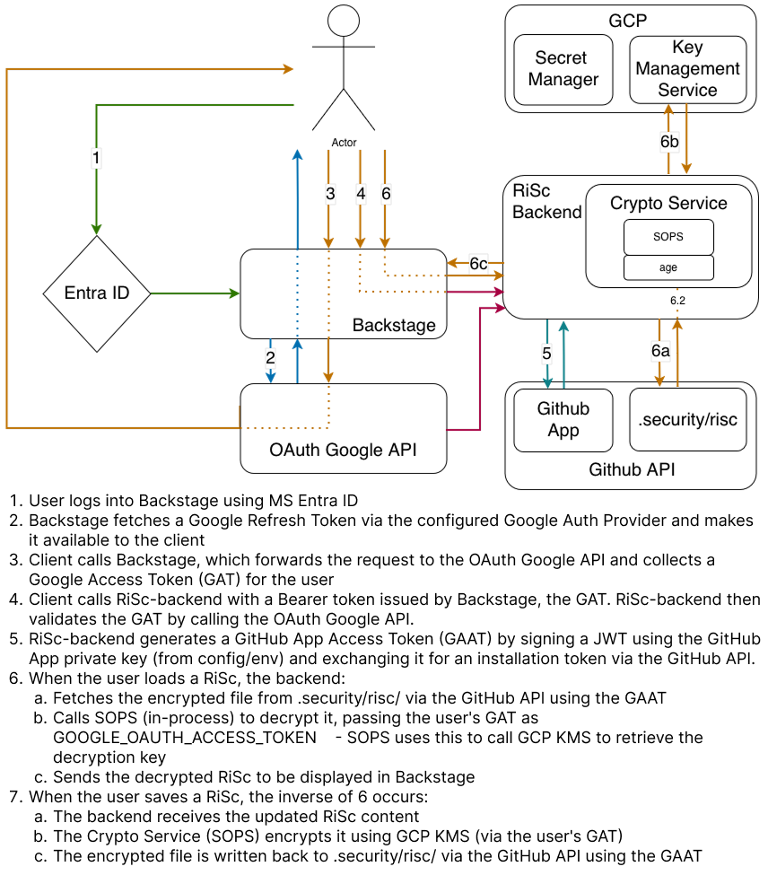
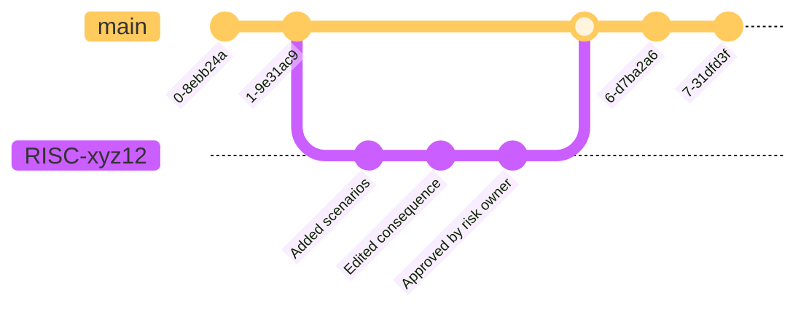

# Running the backend locally
## Prerequisites
>
> 1. The [backstage frontend plugin](https://github.com/kartverket/backstage-plugin-risk-scorecard-frontend) must be running. <br>
     You must also be logged in. This is because the internal Backstage backend (port 7007) is the issuer of tokens this backend uses as OAuth server.
>
> 2. Environment variables are set up
>
### Environment variables
The first step to running the backend locally, either through IntelliJ or Docker, is to set up the necessary environment variables.

Environment variables are loaded from the gitignored `.env` file. <br>
Fill in missing values. Ask a colleague about where you might find these.

```
cp .env.example .env
```
## Run with IntelliJ

### Install SOPS
SOPS is necessary for running the backend locally with IntelliJ. Install with the command:

```shell
brew install sops
```

Or download a specific version manually. See https://github.com/getsops/sops/releases for a guide.


> When running with Docker, SOPS is bundled in the image — no local SOPS installation is needed.


### Start the app from intelliJ
To run the application, simply open the repository locally and select `✨Local Server` as your run configuration, then run it.

#### Local Sandbox Mode
For a fully mocked development environment, you can run the application with the `local-sandboxed` profile. This disables authentication, mocks GitHub storage using the local filesystem, and mocks encryption services.
Run it using:
```shell
./gradlew bootRunLocal
```
<br>


### Linting and formatting

IntelliJ supports code actions on save. <br>
This project uses `ktlint` for code quality checking.
It can be installed as a plugin from marketplace https://plugins.jetbrains.com/plugin/15057-ktlint.

`ktlint` is also available on the command line as tasks in `gradlew` <br>
`./gradlew ktlintCheck` <br>
`./gradlew ktlintFormat` <br>

## Run with Docker

The docker-compose setup contains two different containers (services):

- `app`: Development container.
- `skip`: Production container in [SKIP](https://skip.kartverket.no/).

To run, use these commands:

> Service must be specified.
> They can't all run simultaneously because of conflicting ports.

```
docker-compose build <service-name> # Build image
docker-compose up <service-name> # Start container
```

> Or `docker compose`

# Detailed Documentation of Environment Variables

## OAuth Server

We use the backend of the backstage plugin as our issuer/oauth server.

**ISSUER_URI**: In our case the issuer_uri has been the URL to [Kartverket.dev](https://github.com/kartverket/kartverket.dev) "https://kartverket.dev/api/auth".
For local development the **ISSUER_URI** can be set to "http://localhost:7007/api/auth".

<br>

## Json schema and file specific environment variables

- **RISC_FOLDER_PATH**: The folder in which the RiSc analyses are stored, used for read/write of RiSc's.
- **FILE_NAME_PREFIX**: Used to find the correct files.
- **FILE_NAME_PREFIX**: Used to find the correct files.

<br>

## SOPS and encryption environment variables

- **SOPS_AGE_PRIVATE_KEY**: The Age private key used by the backend to decrypt RiSc files (passed as `SOPS_AGE_KEY` to the `sops` subprocess).
- **BACKEND_PUBLIC_KEY**: The Age public key of the backend, included in key group 2 when encrypting a RiSc file.
- **SECURITY_TEAM_PUBLIC_KEY**: The Age public key of the security team, included in key group 1 alongside the GCP KMS key during encryption.
- **SECURITY_PLATFORM_PUBLIC_KEY**: The Age public key of the security platform, included in key group 2 alongside the backend public key during encryption.

<br>
<br>

# Naming of RiSc files and branches

Because RoS-as-Code is based on using Github for storage, we need to set som rules on how things are to be named.
This is to be able to determine the states of the RiSc analyses and to be able to detect the changes that are being made.

<br>

## RiSc file names

All RiSc analyses needs to be named using a specific convention. It has to be stored in the `.security/risc/` folder, and be named `FILENAME_PREFIX-<5 random numbers and characters>.FILENAME_POSTFIX.yaml`.

<br>

## RiSc branch names

The RiSc branch-name needs to have the same name as the RiSc; `FILENAME_PREFIX-<5 random numbers and characters>`.

<br>

## Commit messages determine the need for approvals

Commit messages are used to determine whether the changes in the draft branch has to be approved by a RiSc-owner or not.
Because we only rely on GitHub we have used the commit messages to make the decision. If the commit log from the latest published version until the latest commit on the draft branch does not include commits with "needs approval", we can publish without approval.

<br>
<br>

# Architecture

<br>

## High level components

This backend handles encrypt and decrypt of RiSc YAML files directly via `SopsCryptoService`, which shells out to the `sops` binary at runtime using a Shamir secret-sharing scheme across Age and GCP KMS key groups.

<br>

## Simplified Architecture (Warning: Outdated)



<br>

## Simplified Git RiSC-flow


```mermaid
%%{init: { 'logLevel': 'debug', 'theme': 'base' } }%%
gitGraph
   commit
   commit
   branch RISC-xyz12
   checkout RISC-xyz12
   commit id: "Added scenarios"
   commit id: "Edited consequence"
   commit id: "Approved by risk owner"
   checkout main
   merge RISC-xyz12
   commit
   commit
```

<br>

## JSON Schema validation

The JSON schema validation is done using the [json-kotlin-schema](https://github.com/pwall567/json-kotlin-schema)
library version 0.44.  
This library has some limitations.  
It does not fully support the latest JSON Schema draft.  
It covers our need regarding the JSON Schema validation.  
If the version of the schema is updated, ensure that the library supports it.

<br>
<br>

# Common errors

<br>

## JWT Decoder Bean fails to initialize

This is most likely due to it not being able to get the JWK-keys, or the key list might be empty. Try to restart the backstage app.
