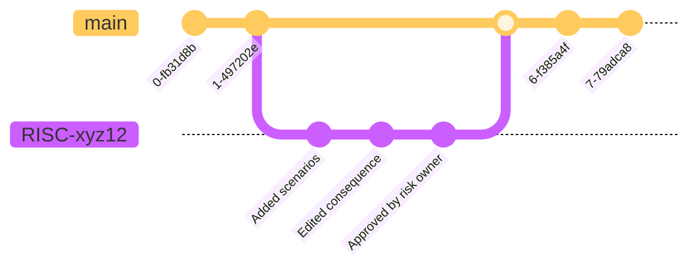

# Running locally

## Run with intellij
We recommend using IntelliJ for local development. The following environment variable must be available to run the application:
- `BACKEND_PUBLIC_KEY`: The public key part used for encryption of RiSc's.

To run the application, simply open the repository locally and select `✨Local Server` as your run configuration, then run it.

Backstage needs to be running, and you need to be logged in for the plugin backend to work. This is because the internal Backstage backend is the issuer of tokens this backend uses as OAuth server.
See [backstage frontend plugin](https://github.com/kartverket/backstage-plugin-risk-scorecard-frontend).

# Setup from scratch: Preconditions and environment variables
## OAuth Server
We use the backend of the backstage plugin as our issuer/oauth server.

**ISSUER_URI**: In our case the issuer_uri has been the URL to [Kartverket.dev](https://github.com/kartverket/kartverket.dev) "https://kartverket.dev/api/auth".
For local development the **ISSUER_URI** can be set to "http://localhost:7007/api/auth".

## Json schema and file specific environment variables
- **RISC_FOLDER_PATH**: The folder in which the risc analyses are stored, used for read/write of RiSc's and the file used to encrypt RiSc's, i.e. `.sops.yaml`.
- **FILE_NAME_PREFIX**: Used to find the correct files.
- **FILE_NAME_PREFIX**: Used to find the correct files.

# Naming of RiSc files and branches
Because RoS-as-Code is based on using Github for storage, we need to set som rules on how things are to be named.
This is to be able to determine the states of the RiSc analyses and to be able to detect the changes that are being made.

## RiSc file names
All RiSc analyses needs to be named using a specific convention. It has to be stored in the `.security/risc/` folder, and be named `FILENAME_PREFIX-<5 random numbers and characters>.FILENAME_POSTFIX.yaml`.

## RiSc branch names
The RiSc branch-name needs to have the same name as the RiSc; `FILENAME_PREFIX-<5 random numbers and characters>`.

## Commit messages determine the need for approvals
Commit messages are used to determine whether the changes in the draft branch has to be approved by a RiSc-owner or not. 
Because we only rely on GitHub we have used the commit messages to make the decision. If the commit log from the latest published version until the latest commit on the draft branch does not include commits with "needs approval", we can publish without approval. 

# Architecture

## High level components

## Simplified Architecture

## Simplified Git RiSC-flow

## JSON Schema validation

The JSON schema validation is done using the [json-kotlin-schema](https://github.com/pwall567/json-kotlin-schema)
library version 0.44.  
This library has some limitations.  
It does not fully support the latest JSON Schema draft.  
It covers our need regarding the JSON Schema validation.  
If the version of the schema is updated, ensure that the library supports it.

# Common errors
## JWT Decoder Bean fails to initialize
This is most likely due to it not being able to get the JWK-keys, or the key list might be empty. Try to restart the backstage app.