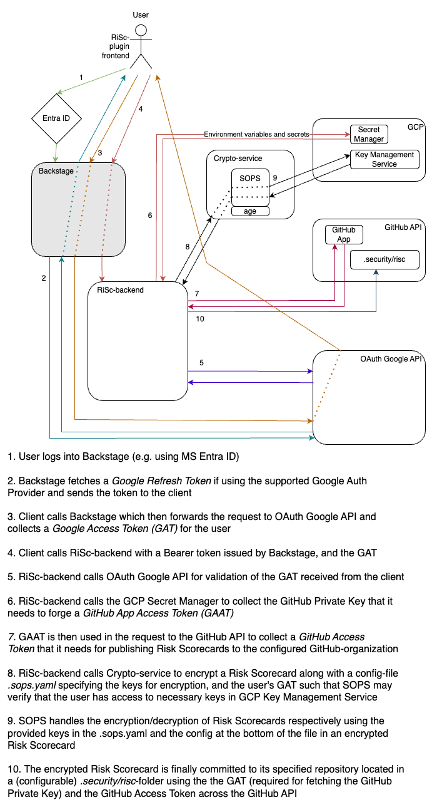

# Risk Scorecard (RiSc) backend

## Setup

Make sure you follow the instructions to set up [the plugin frontend](https://github.com/kartverket/backstage-plugin-risk-scorecard-frontend) first, as you will need it running for the backend to run.

We recommend using IntelliJ for local development. To run the application, simply open the repository locally and select `✨Local Server` as your run configuration, then run it.

Backstage needs to be running, and you need to be logged in for the plugin backend to work. This is because the internal Backstage backend is the issuer of tokens this backend uses as OAuth server. 

## Architecture

### High level components


### Simplified Architecture



### Simplified Git RiSC-flow


### JSON Schema validation

The JSON schema validation is done using the [json-kotlin-schema](https://github.com/pwall567/json-kotlin-schema)
library version 0.44.  
This library has some limitations.  
It does not fully support the latest JSON Schema draft.  
It covers our need regarding the JSON Schema validation.  
If the version of the schema is updated, ensure that the library supports it.

## Alternative setup

> [!WARNING]  
> While we do recommend simply using IntelliJ, some may prefer to run applications through Docker or other means.
> As this is less frequently used, these instructions may be outdated and may no longer function properly.

### Docker

To build the docker image, run:

```sh
docker image build -t backstage-plugin-risk-scorecard-backend .
```

#### Run the application using Docker

The backend application uses a gcp-secret to obtain the GithubApp-private key at the moment. In order to access this we
need a service account with permission to read them.
Configure gcloud with docker, using ```gcloud auth configure-docker```, remember to login first - either using your own
account or by impersonating a service account.

To run the docker image, run:

```sh
docker run -it -p 8080:8080 -e GCP_KMS_RESOURCE_PATH=${GCP_KMS_RESOURCE_PATH} -e SOPS_AGE_PUBLIC_KEY=${SOPS_AGE_PUBLIC_KEY} -e GITHUB_INSTALLATION_ID=${GITHUB_INSTALLATION_ID} -e GITHUB_PRIVATE_KEY_BASE64_ENCODED=${GITHUB_PRIVATE_KEY_BASE64_ENCODED} backstage-plugin-risk-scorecard-backend
```

#### Run the application using kubernetes

The same applies for the gcp application credentials here, so be sure to add a permissions for gcp.

````sh
# configmap 
kubectl apply -f backstage-plugin-risk-scorecard-backend-config.yaml

# app deployment
kubectl apply -f backstage-plugin-risk-scorecard-backend.yaml
````

##### Minikube for local testing

````sh
gcloud auth configure-docker
# to be able to fetch gcp-secret in the app (add)
minikube addons enable gcp-auth
# to be able to pull image from gcp
minikube addons configure registry-creds && minikube addons enable registry-creds
````

## Setup SOPS for doing RiSc locally

See [SOPS.md](SOPS.md)
